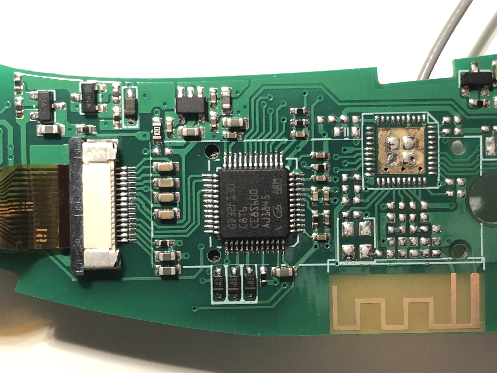
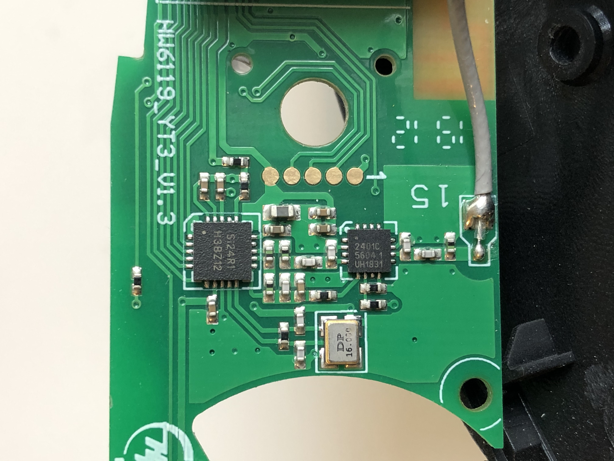
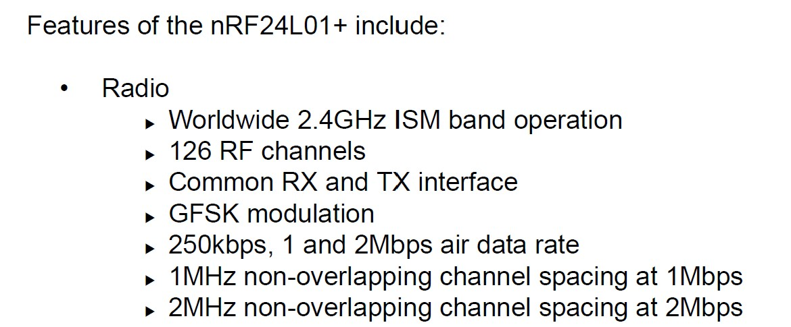

# Hacking X1 Pro
This is a documentation of my attempt at reverse engineering the Exway X1 Pro electric skateboard remote &amp; board.

## Overview

The ultimate goal of this project is to sniff the communication between the skateboard remote and the board and to reverse engineer the packets being transmitted between them. Once the packets are deciphered, I am looking to make a wireless breaking light that works by sniffing the packet data.

Meanwhile, this project will take some detour and will first be examining the hardware used by the remote.

## Remote Hardware

Upon opening up the casing of the remote, we are greeted with a Cortex M3 microcontroller which is tucked under a small display. Vibration motor and pushbutton can be seen on the right side of the PCB. Antenna is located on the bottom on the board.

A closer look at the ARM chip reveals its chip module: [GD32F130](http://gd32mcu.21ic.com/data/documents/shujushouce/GD32F130xx_Datasheet_Rev3.1.pdf) This chip is manufactured by GigaDevice and has same pinout as [STM32L071xx LQFP48](https://www.st.com/resource/en/datasheet/stm32l071cz.pdf). GD32F130 is basically a clone of the ST chip and carries the same functionality as LQFP48.

The back of the remote PCB reveals two more ICs. The one on the right is RFX2401C RF front-end module. The one on the left is Si24R1 and is a Chinese clone of nRF24L01+.

## Finding the Right Frequency

Knowing only the fact that Si24R1 is a 2.4GHz ISM chip is not enough for sniffing, we need more specific information on the number of channels, what frequencies these channels are operating on, and the bit rate data are transferred on. Luckily all these information can be found in the FCC database. X1 Pro's FCC ID is [2APTF-X1](https://fccid.io/2APTF-X1), and its test report submitted to the FCC contains the information we wanted.

From the test report, we can see that X1 Pro operates between 2402-2480 MHz and has a total of 40 different channels. Each channel is separated by a 2 MHz frequency offset.

> | Channel | Frequency (MHz) | Channel | Frequency (MHz) | Channel | Frequency (MHz) |
> | ------- | --------------- | ------- | --------------- | ------- | --------------- |
> | 01      | 2402            | 11      | 2422            | 21      | 2442            |
> | 02      | 2404            | 12      | 2424            | 22      | 2444            |
> | 03      | 2406            | 13      | 2426            | 23      | 2446            |
> | ~       |                 | ~       |                 | ~       |                 |
> | 09      | 2418            | 19      | 2438            | 39      | 2478            |
> | 10      | 2420            | 20      | 2440            | 40      | 2480            |

Know the fact that each channel is separated by 2 MHz offset is crucial in determining the air data rate the chip is operating on. In the below snippet of nRF24L01+ datasheet (Si24R1 is perfectly compatible with nRF24L01+), it specifies that a 2MHz channel spacing translates to 2Mbps air data rate.

## Promiscuous Sniffing on nRF24L01+

Given the fact that Si24Ri is a perfect clone of nRF24L01+, and nRF24L01+ is well documented, I decided to look around and see if there are any available methods of promiscuously sniffing nRF24L01+ packets. It turns out nRF24L01+ has been successfully sniffed in 2011. Travis Godspeed did a well-documented [blog](http://travisgoodspeed.blogspot.com/2011/02/promiscuity-is-nrf24l01s-duty.html) on technical implementations of this promiscuous sniffing. My sniffing program for this project is based on his research, and I recommend anyone who is interested in this project to take a look at his writeup.

Travis' implementation of promiscuous sniffing can be boiled down to 4 parts:

1. Limit the MAC address to 2 bytes
2. Disable checksums
3. Set the MAC to be the same as the preamble
4. Sort received noise for valid MAC address

### Hardware Setup

This setup requires an NRF24L01+ chip and an Arduino. Both hardware are readily available. There are a lot of resources out there on how to set this up. The NRF24L01+ breakout board is connected to the Arduino through SPI. CE and CSN pins on the breakout board can be connected to any digital pins on Arduino.

## Packet Protocol

Upon finding the right address for the remote and successful sniffing, I got the chance to take a look at the packets. The electric skateboard we are working with has very customizable controls. Users are able to toggle on and off features like cruise control, free mode (aka bidirectional mode, board goes in reverse after braking to a stop), turbo mode (unlocks higher top speed), and a lot more. These parameters are all encoded in the payload.

`CE5280050180001C9A198AA6C39818000000002787403C8FD65B3B0D4D6DEBE9`

Above is an example of the payload part of a packet sent by the remote. Surprisingly, the payload is not encrypted in anyway, and as long as you have the right address, you will be able to read the payload. There are still a lot information in the payload that I don't know how to interpret, but here is what I know.

### Gear Level

`0x18` represents the current gear level. If the board is put in free mode,  the hex encoding changes depending the direction of the throttle.

| HEX  | Gear Level (traveling forward) |
| ---- | ------------------------------ |
| 0x00 | Level 1                        |
| 0x08 | Level 2                        |
| 0x10 | Level 3                        |
| 0x18 | Level 4                        |

| HEX  | Gear Level (traveling backward) |
| ---- | ------------------------------- |
| 0x40 | Level 1                         |
| 0x48 | Level 2                         |
| 0x50 | Level 3                         |
| 0x58 | Level 4                         |

However if the board is not in free mode, hex encoding does not change with direction (which makes sense). It stays in the format shown in the *Gear Level (traveling backward)* table.

### Throttle

Above is when throttle is idle in free mode gear level 4.

Above is full throttle in free mode gear level 4.

Same as gear level, encoding for throttle is also affected by whether the board is put in free mode. When board is in free mode, throttle starts from 1 and grows in magnitude when throttle is increased. However, as shown in the image above, throttle does overlap with the least significant 4 bits of the gear level (maybe to prevent accidental gear change when applying throttle?) 

